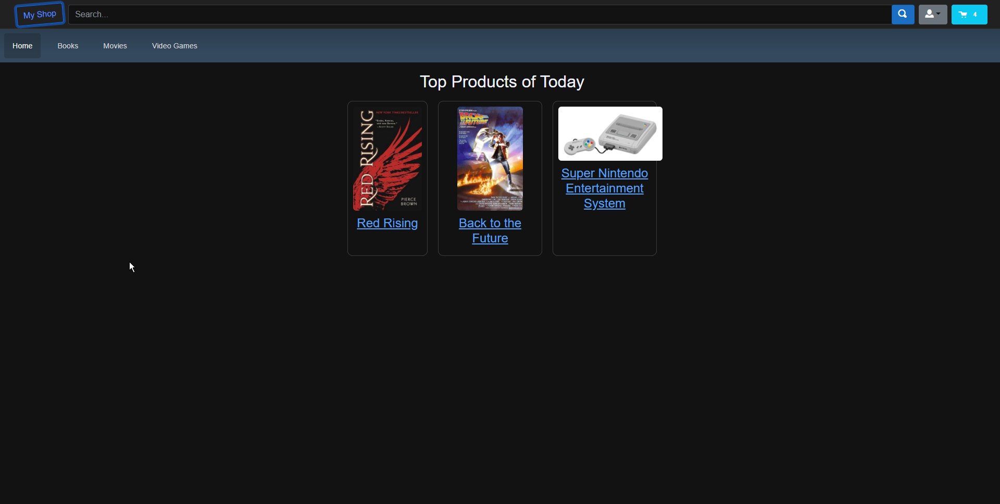
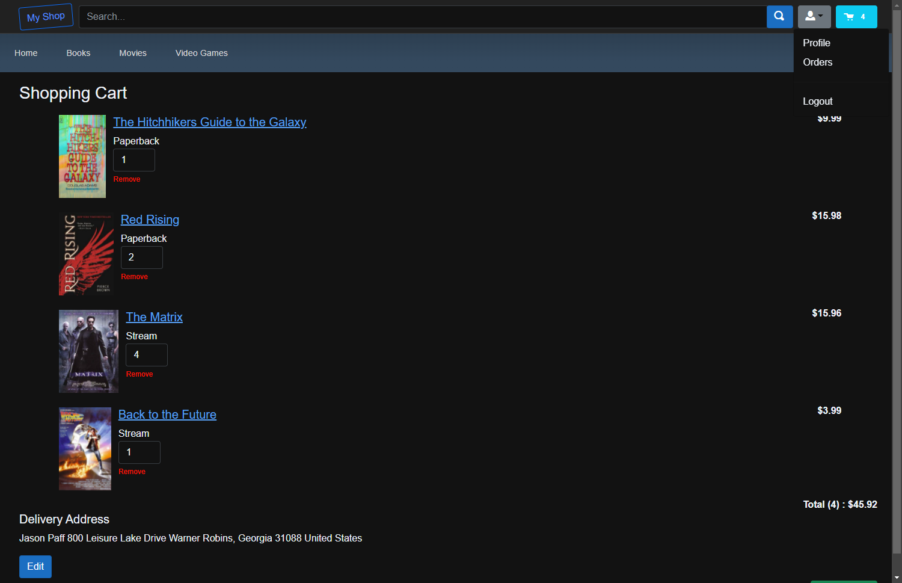
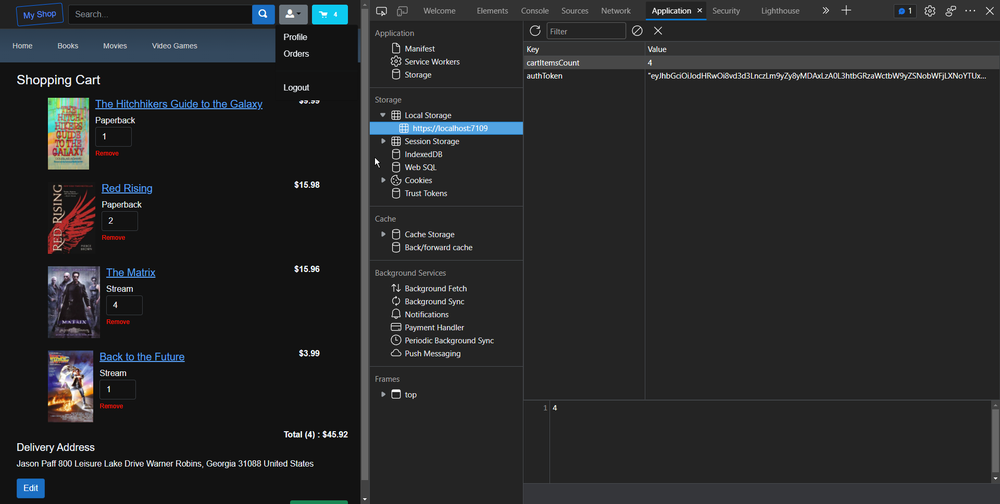
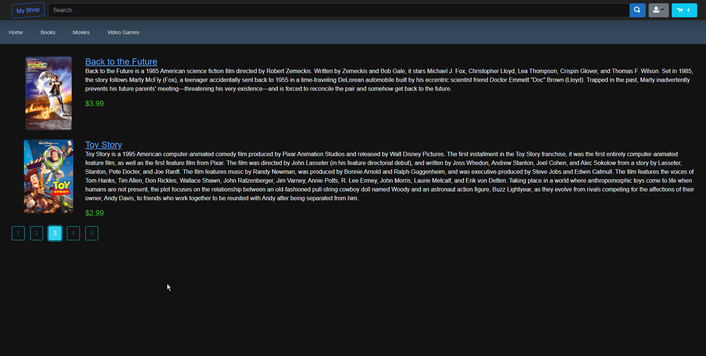

# Blazor Ecommerce Site

Tech Stack - C# / Asp.Net / Blazor / SQL Server / Entity Framework

APIs - Stripe

ECommerce is a proof of concept website that was created to showcase my Asp.Net Blazor knowledge. The site showcases the MVC architecture and numerous other best practices such as JWT authentication and Dependency Injection. The database used was SQL Server with Entity Framework Core providing the ORM. Stripe checkout was integrated using WebHooks to fulfill orders. The admin dashboard allows for full CRUD operations on the products in the database.

